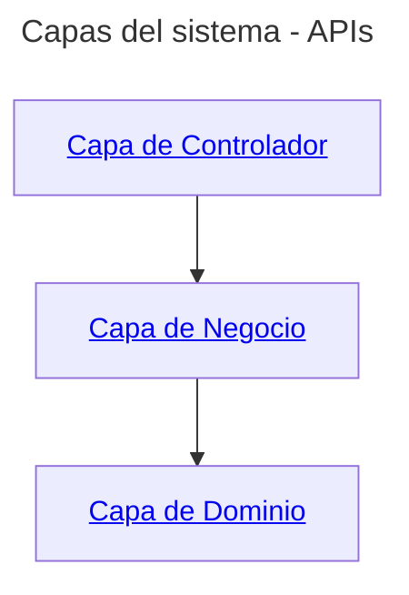

# Documentación del Backend de la Aplicación de Diccionarios

Este repositorio contiene la **documentación** del **Backend de la Aplicación de Diccionarios** utilizada en los cursos y formaciones de **Iván Osuna**.

Incluye modelos UML, ejemplos de código y explicaciones detalladas sobre cómo estructurar un backend RESTful utilizando una arquitectura en capas y buenas prácticas de desarrollo.

## Descripción

La documentación cubre cómo estructurar un backend para la gestión de diccionarios, palabras, significados, variantes morfológicas y otros elementos relacionados.

### Casos de uso
```mermaid
---
title: Diagrama de Casos de Uso - Aplicación de Diccionarios
---

actor Usuario as U
actor "Editor de diccionarios" as E

U --> (Buscar Palabras)
U --> (Consultar Diccionario)
U --> (Ver Significados)
U --> (Ver Sinónimos)
U --> (Ver Variantes)

E --> (Añadir Palabra)
E --> (Eliminar Palabra)
E --> (Modificar Palabra)
E --> (Añadir Significado)
E --> (Eliminar Significado)
E --> (Modificar Significado)
E --> (Gestionar Variantes)
E --> (Gestionar Idiomas)
E --> (Gestionar Diccionarios)


```

### Arquitectura en capas del backend

Para el backend se han definido las siguientes capas:



## Propósito

El objetivo de este proyecto es servir como un recurso educativo para los estudiantes y desarrolladores que participan en los cursos y videos de **Iván Osuna**. A través de esta documentación, los usuarios aprenderán:

- Cómo diseñar un backend RESTful completo.
- La estructura típica de un backend en capas.
- Buenas prácticas para el manejo de entidades relacionadas con diccionarios y palabras.

## Uso

Puedes utilizar esta documentación como guía para desarrollar tus propias aplicaciones backend o para complementar los cursos en los que se utiliza como material didáctico.

1. **Navega por la documentación**: Examina las distintas capas de la arquitectura (controlador, servicio, DTOs) y los ejemplos detallados.
2. **Aplica los conceptos**: Implementa lo aprendido en tus propios proyectos o sigue los ejemplos mostrados en los cursos.

## Contribución

Por ahora, este repositorio está limitado a documentación, pero si deseas contribuir con mejoras o correcciones en el contenido, puedes hacerlo de la siguiente manera:

1. Haz un fork del repositorio.
2. Realiza los cambios en tu propio fork.
3. Envía un **Pull Request** con tus sugerencias o mejoras.

## Licencia

Este proyecto y su contenido están protegidos por derechos de autor **© 2024 Iván Osuna**. No se permite su uso comercial sin autorización expresa. 

Este material está licenciado bajo la **Licencia Creative Commons Atribución-NoComercial-CompartirIgual 4.0 Internacional**. Puedes compartir y adaptar el contenido bajo las condiciones de atribución, no comercialización y compartir igual.

---

## Contacto

Para consultas o más información:

- **Iván Osuna**
- Email: [ivan.osuna.ayuste@gmail.com](mailto:ivan.osuna.ayuste@gmail.com)
---

<p align="center">
    <strong>README.md</strong> |
    <a href="https://github.com/IvanciniGT/appDiccionarios/blob/master/capa-controlador.md">Capa de Controlador</a> |
    <a href="https://github.com/IvanciniGT/appDiccionarios/blob/master/capa-servicio.md">Capa de Negocio</a> |
    <a href="https://github.com/IvanciniGT/appDiccionarios/blob/master/capa-dominio.md">Capa de Dominio</a>
</p>
