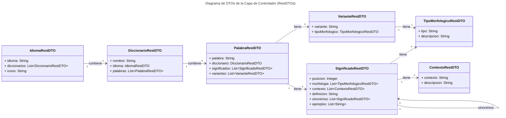
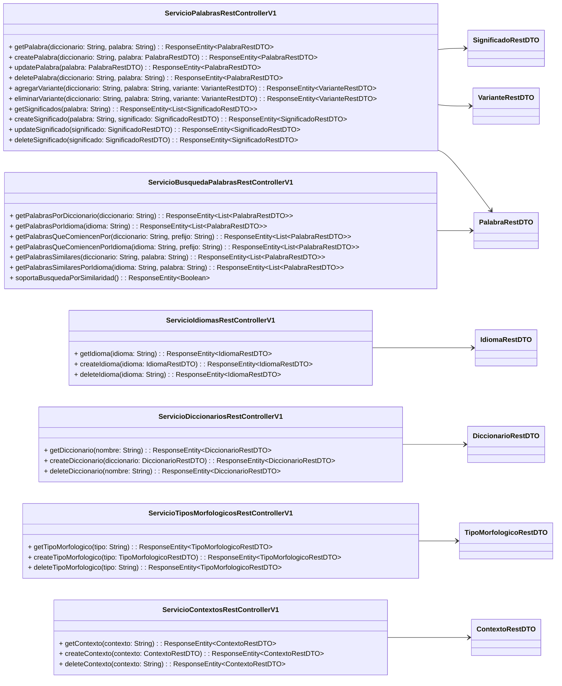

    <a href="https://github.com/IvanciniGT/appDiccionarios/blob/master/README.md">README</a> |
    <strong>Capa de Controlador</strong> |
    <a href="https://github.com/IvanciniGT/appDiccionarios/blob/master/capa-servicio.md">Capa de Negocio</a> |
    <a href="https://github.com/IvanciniGT/appDiccionarios/blob/master/capa-dominio.md">Capa de Dominio</a>

---
# Capa de Controlador de la Aplicación de Diccionarios

Este es un ejemplo de backend utilizado en los videos y formaciones de **Iván Osuna Ayuste**, y está protegido bajo la licencia **Creative Commons BY-NC-SA** y las leyes de **Copyright ©**. [Ver más...](#copyright-y-licencia)

© 2024 Iván Osuna Ayuste. Todos los derechos reservados.

# Índice

- [1. Introducción](#1-introducción)
  - [1.1 Conceptos Clave](#11-conceptos-clave)
- [2. Definición de los DTOs](#2-definición-de-los-dtos)
  - [2.1 Diagrama UML de los DTOs](#21-diagrama-uml-de-los-dtos)
  - [2.2 Detalle de los DTOs](#22-detalle-de-los-dtos)
    - [2.2.1 IdiomaRestDTO](#221-idiomarestdto)
    - [2.2.2 DiccionarioRestDTO](#222-diccionariorestdto)
    - [2.2.3 PalabraRestDTO](#223-palabrarestdto)
    - [2.2.4 SignificadoRestDTO](#224-significadorestdto)
    - [2.2.5 VarianteRestDTO](#225-variantarestdto)
    - [2.2.6 TipoMorfologicoRestDTO](#226-tipomorfologicorestdto)
    - [2.2.7 ContextoRestDTO](#227-contextorestdto)
- [3. Definición de los Controladores](#3-definición-de-los-controladores)
  - [3.1 Diagrama UML de los Controladores](#31-diagrama-uml-de-los-controladores)
  - [2.2 Detalle de los Controladores y Funciones](#32-detalle-de-los-controladores-y-funciones)
    - [2.2.1 ServicioPalabrasRestControllerV1](#321-serviciopalabrasrestcontrollerv1)
    - [2.2.2 ServicioBusquedaPalabrasRestControllerV1](#322-serviciobusquedapalabrasrestcontrollerv1)
    - [2.2.3 ServicioIdiomasRestControllerV1](#323-servicioidiomasrestcontrollerv1)
    - [2.2.4 ServicioDiccionariosRestControllerV1](#324-serviciodiccionariosrestcontrollerv1)
    - [2.2.5 ServicioTiposMorfologicosRestControllerV1](#325-serviciotiposmorfologicosrestcontrollerv1)
    - [2.2.6 ServicioContextosRestControllerV1](#326-serviciocontextosrestcontrollerv1)

---
## 1. Introducción

La **Capa de Controlador** en una arquitectura REST tiene como responsabilidad principal exponer los servicios de la aplicación a clientes externos, como aplicaciones web o móviles, mediante una interfaz HTTP. Esta capa recibe las solicitudes HTTP, valida los datos de entrada, invoca los servicios de la capa de negocio, y devuelve respuestas adecuadas al cliente. Los controladores están diseñados siguiendo el patrón de diseño MVC (Model-View-Controller), y se implementan con tecnologías como **Spring MVC** en un contexto de aplicaciones Java.

En la aplicación de **Diccionarios**, los controladores permiten a los usuarios acceder a operaciones como la consulta de palabras, la gestión de diccionarios, la creación y modificación de significados, variantes, y otros elementos asociados. Cada controlador está asociado a una entidad específica, como palabras o diccionarios, y expone un conjunto de endpoints HTTP que corresponden a las operaciones CRUD (Crear, Leer, Actualizar, Eliminar) o acciones más complejas según el caso.

Una característica importante de la **Capa de Controlador** es que utiliza sus propios **DTOs** (Data Transfer Objects), denominados **RestDTOs**, que están diseñados para representar la información que se envía y recibe a través de la API. Estos **RestDTOs** son versiones simplificadas de las entidades de la aplicación y están orientados a facilitar la transferencia de datos entre el cliente y el servidor sin exponer detalles innecesarios sobre el modelo de dominio.

### 1.1 Conceptos Clave

- **Capa de Controlador**: Responsable de recibir solicitudes HTTP, validar datos de entrada, invocar servicios de negocio, y devolver respuestas a los clientes.
- **RestDTO**: Objeto de transferencia de datos utilizado en la **Capa de Controlador**, que encapsula la información que se envía y recibe en las peticiones y respuestas HTTP.
- **Endpoint**: Dirección URL expuesta por el controlador que permite a los clientes interactuar con los servicios a través de solicitudes HTTP (GET, POST, PUT, DELETE).
- **Spring MVC**: Framework de Java utilizado para implementar los controladores REST en una arquitectura basada en modelos, vistas y controladores.
- **Validación de datos**: Proceso de asegurar que los datos de entrada recibidos en una solicitud HTTP cumplan con los requisitos antes de invocar los servicios de negocio.

## 2. Definición de los DTOs

Los **RestDTOs** son objetos de transferencia de datos diseñados para la **Capa de Controlador** y se encargan de representar los datos que se intercambian entre el cliente y el servidor a través de las solicitudes HTTP. Estos **RestDTOs** encapsulan las propiedades necesarias para realizar las operaciones en los controladores y no contienen lógica de negocio.

En la aplicación de Diccionarios, los **RestDTOs** son versiones simplificadas de las entidades del dominio, como **PalabraRestDTO**, **DiccionarioRestDTO**, o **SignificadoRestDTO**. Cada uno de estos DTOs contiene solo los atributos relevantes para las operaciones de la API REST.

### 2.1 Diagrama UML de los DTOs

A continuación, presentamos el diagrama UML de los **RestDTOs** utilizados en la **Capa de Controlador**:

### 2.2 Detalle de los DTOs

#### 2.2.1 **IdiomaRestDTO**
- **IdiomaRestDTO** representa el idioma que se utiliza en un diccionario o en una palabra.
- Atributos principales:
  - `idioma`: Código que identifica el idioma (por ejemplo, `es` para español).
  - `diccionarios`: Lista de diccionarios asociados a este idioma.
  - `icono`: Representación visual del idioma.

#### 2.2.2 **DiccionarioRestDTO**
- **DiccionarioRestDTO** contiene la información de un diccionario, que incluye las palabras y el idioma asociado.
- Atributos principales:
  - `nombre`: Nombre del diccionario.
  - `idioma`: El idioma en el que está escrito el diccionario, representado por **IdiomaRestDTO**.
  - `palabras`: Lista de palabras incluidas en el diccionario, representadas por **PalabraRestDTO**.

#### 2.2.3 **PalabraRestDTO**
- **PalabraRestDTO** representa una palabra en el diccionario y sus asociaciones con significados y variantes.
- Atributos principales:
  - `palabra`: El texto de la palabra.
  - `diccionario`: El diccionario al que pertenece la palabra, representado por **DiccionarioRestDTO**.
  - `significados`: Lista de significados asociados a la palabra, representados por **SignificadoRestDTO**.
  - `variantes`: Lista de variantes de la palabra

, representadas por **VarianteRestDTO**.

#### 2.2.4 **SignificadoRestDTO**
- **SignificadoRestDTO** representa el significado de una palabra en un contexto específico.
- Atributos principales:
  - `posicion`: Posición del significado en la lista de significados de la palabra.
  - `morfologia`: Lista de morfologías asociadas al significado, representadas por **TipoMorfologicoRestDTO**.
  - `contexto`: Lista de contextos en los que se aplica el significado, representados por **ContextoRestDTO**.
  - `definicion`: Definición textual del significado.
  - `sinonimos`: Lista de sinónimos asociados al significado.
  - `ejemplos`: Lista de ejemplos de uso del significado.

#### 2.2.5 **VarianteRestDTO**
- **VarianteRestDTO** representa una variante morfológica de una palabra.
- Atributos principales:
  - `variante`: El texto de la variante.
  - `tipoMorfologico`: El tipo morfológico de la variante, representado por **TipoMorfologicoRestDTO**.

#### 2.2.6 **TipoMorfologicoRestDTO**
- **TipoMorfologicoRestDTO** representa la categoría gramatical de una palabra o variante.
- Atributos principales:
  - `tipo`: El tipo de morfología (sustantivo, verbo, etc.).
  - `descripcion`: Descripción detallada del tipo morfológico.

#### 2.2.7 **ContextoRestDTO**
- **ContextoRestDTO** define el contexto en el que se utiliza un significado particular.
- Atributos principales:
  - `contexto`: Texto descriptivo del contexto.
  - `descripcion`: Descripción detallada del contexto.

## 3. Definición de los Controladores

Los controladores son los componentes de la **Capa de Controlador** que manejan las solicitudes HTTP entrantes y coordinan las interacciones con los servicios de negocio. Cada controlador está diseñado para manejar las operaciones de una entidad específica (como **Palabras** o **Diccionarios**) y expone un conjunto de endpoints REST que corresponden a las operaciones CRUD y otras acciones relevantes.

### 3.1 Diagrama UML de los Controladores

A continuación, se presenta el diagrama UML que describe los controladores de la aplicación, junto con sus principales operaciones:

Aquí tienes el apartado 2.2 detallado con las funciones de los controladores y los DTOs correspondientes, siguiendo el mismo nivel de detalle que en capas anteriores:

## 3.2 Detalle de los Controladores y Funciones

### 3.2.1 **ServicioPalabrasRestControllerV1**

Este controlador gestiona las operaciones relacionadas con las palabras de un diccionario. Aquí están los métodos detallados:

- **`getPalabra(diccionario: String, palabra: String): ResponseEntity<PalabraRestDTO>`**
  - **Descripción**: Recupera una palabra específica de un diccionario dado.
  - **Respuesta**: Devuelve un `ResponseEntity` con el `PalabraRestDTO` si la palabra se encuentra, o un código de error adecuado en caso contrario (404 si no se encuentra).
  
- **`createPalabra(diccionario: String, palabra: PalabraRestDTO): ResponseEntity<PalabraRestDTO>`**
  - **Descripción**: Crea una nueva palabra en el diccionario especificado.
  - **Respuesta**: Devuelve un `ResponseEntity` con el `PalabraRestDTO` creado o un código de error si los datos no son válidos o la palabra ya existe (409 para duplicados).
  
- **`updatePalabra(palabra: PalabraRestDTO): ResponseEntity<PalabraRestDTO>`**
  - **Descripción**: Modifica una palabra existente.
  - **Respuesta**: Devuelve un `ResponseEntity` con la palabra actualizada o un código de error si la palabra no existe (404).

- **`deletePalabra(diccionario: String, palabra: String): ResponseEntity<PalabraRestDTO>`**
  - **Descripción**: Elimina una palabra del diccionario.
  - **Respuesta**: Devuelve un `ResponseEntity` con la palabra eliminada o un código de error si la palabra no se encuentra (404).

- **`agregarVariante(diccionario: String, palabra: String, variante: VarianteRestDTO): ResponseEntity<VarianteRestDTO>`**
  - **Descripción**: Agrega una nueva variante morfológica a la palabra en el diccionario.
  - **Respuesta**: Devuelve un `ResponseEntity` con la nueva variante o un código de error si los datos no son válidos (400).

- **`eliminarVariante(diccionario: String, palabra: String, variante: VarianteRestDTO): ResponseEntity<VarianteRestDTO>`**
  - **Descripción**: Elimina una variante específica de una palabra.
  - **Respuesta**: Devuelve un `ResponseEntity` con la variante eliminada o un código de error si la variante no se encuentra (404).

- **`getSignificados(palabra: String): ResponseEntity<List<SignificadoRestDTO>>`**
  - **Descripción**: Recupera todos los significados de una palabra.
  - **Respuesta**: Devuelve un `ResponseEntity` con la lista de significados o un código de error si no se encuentran significados (404).

- **`createSignificado(palabra: String, significado: SignificadoRestDTO): ResponseEntity<SignificadoRestDTO>`**
  - **Descripción**: Crea un nuevo significado para una palabra existente.
  - **Respuesta**: Devuelve un `ResponseEntity` con el significado creado o un código de error si los datos no son válidos (400) o ya existe el significado (409).

- **`updateSignificado(significado: SignificadoRestDTO): ResponseEntity<SignificadoRestDTO>`**
  - **Descripción**: Modifica un significado existente de una palabra.
  - **Respuesta**: Devuelve un `ResponseEntity` con el significado actualizado o un código de error si no se encuentra el significado (404).

- **`deleteSignificado(significado: SignificadoRestDTO): ResponseEntity<SignificadoRestDTO>`**
  - **Descripción**: Elimina un significado de una palabra.
  - **Respuesta**: Devuelve un `ResponseEntity` con el significado eliminado o un código de error si no se encuentra (404).

### 3.2.2 **ServicioBusquedaPalabrasRestControllerV1**

Este controlador se encarga de realizar búsquedas sobre las palabras de los diccionarios.

- **`getPalabrasPorDiccionario(diccionario: String): ResponseEntity<List<PalabraRestDTO>>`**
  - **Descripción**: Devuelve una lista de todas las palabras de un diccionario específico.
  - **Respuesta**: Devuelve un `ResponseEntity` con la lista de palabras o un código de error si no se encuentra el diccionario (404).

- **`getPalabrasPorIdioma(idioma: String): ResponseEntity<List<PalabraRestDTO>>`**
  - **Descripción**: Devuelve una lista de palabras de todos los diccionarios en un idioma específico.
  - **Respuesta**: Devuelve un `ResponseEntity` con la lista de palabras o un código de error si no se encuentran palabras en ese idioma (404).

- **`getPalabrasQueComiencenPor(diccionario: String, prefijo: String): ResponseEntity<List<PalabraRestDTO>>`**
  - **Descripción**: Devuelve todas las palabras de un diccionario que comiencen por un prefijo específico.
  - **Respuesta**: Devuelve un `ResponseEntity` con la lista de palabras o un código de error si no se encuentran palabras que coincidan con el prefijo (404).

- **`getPalabrasQueComiencenPorIdioma(idioma: String, prefijo: String): ResponseEntity<List<PalabraRestDTO>>`**
  - **Descripción**: Devuelve todas las palabras en un idioma específico que comiencen por un prefijo.
  - **Respuesta**: Devuelve un `ResponseEntity` con la lista de palabras o un código de error si no se encuentran palabras (404).

- **`getPalabrasSimilares(diccionario: String, palabra: String): ResponseEntity<List<PalabraRestDTO>>`**
  - **Descripción**: Devuelve una lista de palabras similares a una palabra dada en un diccionario específico.
  - **Respuesta**: Devuelve un `ResponseEntity` con la lista de palabras o un código de error si no se encuentran palabras similares (404).

- **`getPalabrasSimilaresPorIdioma(idioma: String, palabra: String): ResponseEntity<List<PalabraRestDTO>>`**
  - **Descripción**: Devuelve una lista de palabras similares a una palabra dada en un idioma específico.
  - **Respuesta**: Devuelve un `ResponseEntity` con la lista de palabras o un código de error si no se encuentran palabras similares (404).

- **`soportaBusquedaPorSimilaridad(): ResponseEntity<Boolean>`**
  - **Descripción**: Devuelve si el sistema soporta o no búsquedas por similaridad.
  - **Respuesta**: Devuelve un `ResponseEntity` con `true` o `false`.

### 3.2.3 **ServicioIdiomasRestControllerV1**

Este controlador gestiona las operaciones relacionadas con los idiomas.

- **`getIdioma(idioma: String): ResponseEntity<IdiomaRestDTO>`**
  - **Descripción**: Recupera un idioma específico.
  - **Respuesta**: Devuelve un `ResponseEntity` con el idioma si se encuentra o un código de error si no (404).

- **`createIdioma(idioma: IdiomaRestDTO): ResponseEntity<IdiomaRestDTO>`**
  - **Descripción**: Crea un nuevo idioma.
  - **Respuesta**: Devuelve un `ResponseEntity` con el idioma creado o un código de error si los datos son inválidos (400).

- **`deleteIdioma(idioma: String): ResponseEntity<IdiomaRestDTO>`**
  - **Descripción**: Elimina un idioma.
  - **Respuesta**: Devuelve un `ResponseEntity` con el idioma eliminado o un código de error si el idioma tiene diccionarios asociados (409).

### 3.2.4 **ServicioDiccionariosRestControllerV1**

Este controlador se encarga de gestionar diccionarios.

- **`getDiccionario(nombre: String): ResponseEntity<DiccionarioRestDTO>`**
  - **Descripción**: Recupera un diccionario específico por su nombre.
  - **Respuesta**: Devuelve un `ResponseEntity` con el diccionario o un código de error si no se encuentra (404).

- **`createDiccionario(diccionario: DiccionarioRestDTO): ResponseEntity<DiccionarioRestDTO>`**
  - **Descripción**: Crea un nuevo diccionario.
  - **Respuesta**: Devuelve un `ResponseEntity` con el diccionario creado o un código de error si ya existe (409).

- **`deleteDiccionario(nombre: String): ResponseEntity<DiccionarioRestDTO>`**
  - **Descripción**: Elimina un diccionario específico.
  - **Respuesta**: Devuelve un `ResponseEntity` con el diccionario eliminado o un código de error si no se encuentra (404).

### 3.2.5 **ServicioTiposMorfologicosRestControllerV1**

Este controlador gestiona los tipos morfológicos.

- **`getTipoMorfologico(tipo: String): ResponseEntity<TipoMorfologicoRestDTO>`**
  - **Descripción**: Recupera un tipo morfológico específico.
  - **Respuesta**: Devuelve un `ResponseEntity` con el tipo morfológico o un código de error si no se encuentra (404).

- **`createTipoMorfologico(tipo: TipoMorfologicoRestDTO): ResponseEntity<TipoMorfologicoRestDTO>`**
  - **Descripción**: Crea un nuevo tipo morfológico.
  - **Respuesta**: Devuelve un `ResponseEntity` con el tipo

 morfológico creado o un código de error si ya existe (409).

- **`deleteTipoMorfologico(tipo: String): ResponseEntity<TipoMorfologicoRestDTO>`**
  - **Descripción**: Elimina un tipo morfológico específico.
  - **Respuesta**: Devuelve un `ResponseEntity` con el tipo morfológico eliminado o un código de error si no se encuentra (404).

### 3.2.6 **ServicioContextosRestControllerV1**

Este controlador gestiona los contextos en los que se aplican los significados de palabras.

- **`getContexto(contexto: String): ResponseEntity<ContextoRestDTO>`**
  - **Descripción**: Recupera un contexto específico.
  - **Respuesta**: Devuelve un `ResponseEntity` con el contexto o un código de error si no se encuentra (404).

- **`createContexto(contexto: ContextoRestDTO): ResponseEntity<ContextoRestDTO>`**
  - **Descripción**: Crea un nuevo contexto.
  - **Respuesta**: Devuelve un `ResponseEntity` con el contexto creado o un código de error si ya existe (409).

- **`deleteContexto(contexto: String): ResponseEntity<ContextoRestDTO>`**
  - **Descripción**: Elimina un contexto específico.
  - **Respuesta**: Devuelve un `ResponseEntity` con el contexto eliminado o un código de error si no se encuentra (404).

---
## Copyright y Licencia

**© 2024 Iván Osuna Ayuste. Todos los derechos reservados**.

Este material, este documento y su contenido están licenciados bajo la licencia [Licencia Creative Commons Reconocimiento-NoComercial-CompartirIgual 4.0 Internacional (CC BY-NC-SA 4.0)](https://creativecommons.org/licenses/by-nc-sa/4.0/).

 **Queda expresamente prohibido el uso en formaciones comerciales** por terceros sin autorización expresa del autor.

 ---

    <a href="https://github.com/IvanciniGT/appDiccionarios/blob/master/README.md">README</a> |
    <strong>Capa de Controlador</strong> |
    <a href="https://github.com/IvanciniGT/appDiccionarios/blob/master/capa-servicio.md">Capa de Negocio</a> |
    <a href="https://github.com/IvanciniGT/appDiccionarios/blob/master/capa-dominio.md">Capa de Dominio</a>

