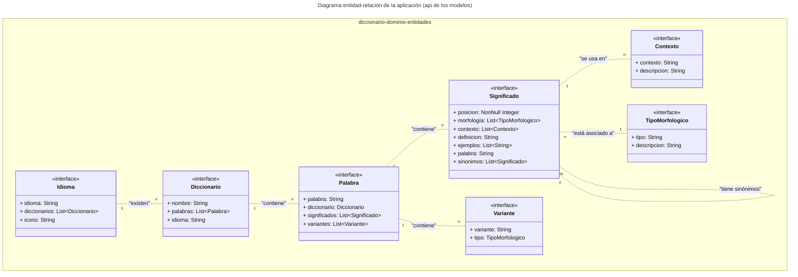
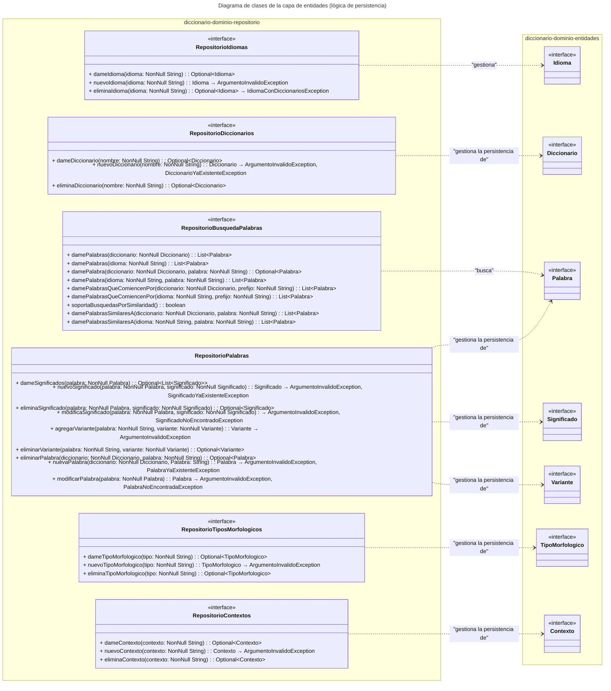
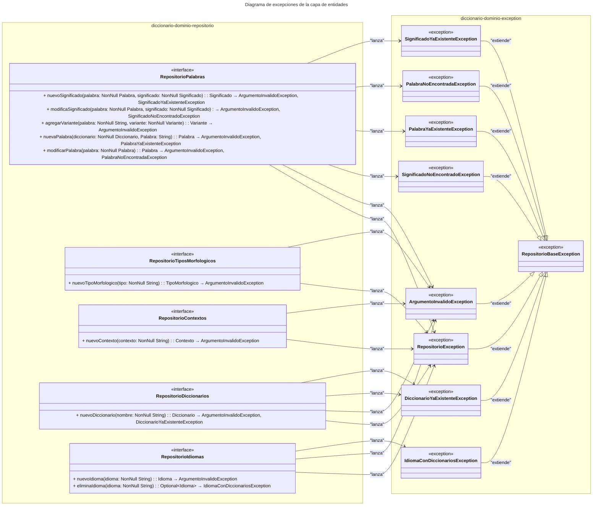

    <a href="https://github.com/IvanciniGT/appDiccionarios/blob/master/README.md">README</a> |
    <a href="https://github.com/IvanciniGT/appDiccionarios/blob/master/capa-controlador.md">Capa de Controlador</a> |
    <a href="https://github.com/IvanciniGT/appDiccionarios/blob/master/capa-servicio.md">Capa de Negocio</a> |
    <strong>Capa de Dominio</strong>

---

# Capa de Dominio de la Aplicación de Diccionarios

Este es un ejemplo de backend utilizado en los videos y formaciones de **Iván Osuna Ayuste**, y está protegido bajo la licencia **Creative Commons BY-NC-SA** y las leyes de **Copyright ©**. [Ver más...](#copyright-y-licencia)

© 2024 Iván Osuna Ayuste. Todos los derechos reservados.

## Índice

1. [Introducción](#1-introducción)  
   1.1 [Conceptos Clave](#11-conceptos-clave)

2. [Modelos de la Capa de Dominio](#2-modelos-de-la-capa-de-dominio)  
   2.1 [Diagrama Entidad-Relación](#21-diagrama-entidad-relación)  
   2.2 [Detalle de las Entidades](#22-detalle-de-las-entidades)  
       2.2.1 [Idioma](#221-idioma)  
       2.2.2 [Diccionario](#222-diccionario)  
       2.2.3 [Tipo Morfológico](#223-tipo-morfológico)  
       2.2.4 [Palabra](#224-palabra)  
       2.2.5 [Contexto](#225-contexto)  
       2.2.6 [Significado](#226-significado)  
       2.2.7 [Variante](#227-variante)

3. [Repositorios de la Capa de Dominio](#3-repositorios-de-la-capa-de-dominio)  
   3.1 [Diagrama de Repositorios](#31-diagrama-de-repositorios)  
   3.2 [Detalle de los Repositorios](#32-detalle-de-los-repositorios)  
       3.2.1 [RepositorioTiposMorfologicos](#321-repositoriotiposmorfologicos)  
       3.2.2 [RepositorioContextos](#322-repositoriocontextos)  
       3.2.3 [RepositorioDiccionarios](#323-repositoriodiccionarios)  
       3.2.4 [RepositorioIdiomas](#324-repositorioidiomas)  
       3.2.5 [RepositorioBusquedaPalabras](#325-repositoriobusquedapalabras)  
       3.2.6 [RepositorioPalabras](#326-repositoriopalabras)

4. [Excepciones de la Capa de Dominio](#4-excepciones-de-la-capa-de-dominio)  
   4.1 [Diagrama de Excepciones](#41-diagrama-de-excepciones)  
   4.2 [Detalle de las Excepciones](#42-detalle-de-las-excepciones)  
       4.2.1 [RepositorioBaseException](#421-repositoriobaseexception)  
       4.2.2 [ArgumentoInvalidoException](#422-argumentoinvalidoexception)  
       4.2.3 [SignificadoNoEncontradoException](#423-significadonoencontradoexception)  
       4.2.4 [DiccionarioYaExistenteException](#424-diccionarioyaexistenteexception)  
       4.2.5 [PalabraYaExistenteException](#425-palabrayaexistenteexception)  
       4.2.6 [PalabraNoEncontradaException](#426-palabranoencontradaexception)  
       4.2.7 [SignificadoYaExistenteException](#427-significadoyaexistenteexception)  
       4.2.8 [IdiomaConDiccionariosException](#428-idiomacondiccionariosexception)

5. [Aplicación de los Principios KISS, YAGNI, SOLID, SoC y DRY](#5-aplicación-de-los-principios-kiss-yagni-solid-soc-y-dry)  
   5.1 [Principio KISS (Keep It Simple, Stupid)](#51-principio-kiss-keep-it-simple-stupid)  
   5.2 [Principio YAGNI (You Aren't Gonna Need It)](#52-principio-yagni-you-arent-gonna-need-it)  
   5.3 [Principios SOLID](#53-principios-solid)  
   5.4 [Principio DRY (Don't Repeat Yourself)](#54-principio-dry-dont-repeat-yourself)  
   5.5 [Principio de Separation of Concerns (SoC)](#55-principio-de-separation-of-concerns-soc)

---
## 1. Introducción

La **Capa de Dominio** es una de las capas fundamentales de la arquitectura de la aplicación de Diccionarios. En términos simples, la **Capa de Dominio** se refiere a la parte del sistema que define los conceptos centrales del negocio, los datos que representan esos conceptos y las reglas que rigen su comportamiento. Esta capa se encarga de definir tanto los objetos centrales que representan el dominio del problema como las reglas y procesos que gobiernan el comportamiento de estos objetos. Además, define la forma en que los datos serán almacenados y gestionados a través de Repositorios. En este **Contexto**, un repositorio es un componente que actúa como una interfaz para acceder a los datos y gestionar su almacenamiento, proporcionando una forma de abstraer el acceso a los datos sin importar cómo o dónde se almacenen. El objetivo de esta capa es encapsular la lógica del dominio de la aplicación, manteniendo una representación precisa de los conceptos que forman parte del mundo real que queremos modelar.

En este documento, vamos a detallar la API de la **Capa de Dominio**. Se incluirán los modelos y sus métodos, así como los Repositorios y las operaciones asociadas a ellos. Esto permitirá gestionar y manipular los datos de manera segura y eficiente.

En el **Contexto** de una aplicación de Diccionarios, la **Capa de Dominio** incluye conceptos como palabras, significados, **Variantes**, diccionarios e idiomas, así como los Repositorios necesarios para el acceso y la gestión de estos modelos. Por ejemplo, un ****Diccionario**** está compuesto por varias **palabras**, y cada ****Palabra**** puede tener uno o más **significados** asociados, que a su vez pueden tener ****Variantes**** y ****contextos**** específicos en los que se utilizan. Además, los **Repositorios** permiten gestionar la persistencia de estos datos, como almacenar una nueva **Palabra** en el **Diccionario** o actualizar el **Significado** de una **Palabra** existente. Esta capa permite estructurar la información de una manera que sea fácilmente manejable y reutilizable por otras partes del sistema, garantizando también la correcta persistencia de los datos.

Es importante destacar que en la **Capa de Dominio** no se incluye la lógica de negocio. Esta capa se centra en definir los conceptos fundamentales y los datos relacionados con el dominio del problema. La lógica más compleja, que involucra reglas de negocio y procesos específicos, se implementa en la capa de **Servicios**. Por ejemplo, en el **Contexto** de la aplicación de Diccionarios, la **Capa de Dominio** puede tener un modelo ****Palabra**** con atributos como `texto` y `significados`, y métodos simples para manipular esos atributos. Sin embargo, una operación más compleja como "validar la coherencia de los significados antes de añadir una nueva **Palabra**" sería parte de la capa de **Servicios**, no de la **Capa de Dominio**. Esta separación ayuda a mantener una arquitectura clara y modular, en la que cada capa tiene una responsabilidad específica.

A lo largo del documento, se utilizarán varios diagramas para facilitar la comprensión de la **Capa de Dominio** y su relación con otras partes del sistema.

### 1.1 Conceptos Clave

- **Capa de dominio**: Parte del sistema que define los conceptos principales del negocio y los datos que los representan. No incluye la lógica de negocio, ya que las reglas complejas se implementan en la capa de **Servicios**.
- ****Repositorio****: Componente que sirve para acceder y gestionar el almacenamiento de los datos. Proporciona una capa de abstracción para interactuar con los datos sin importar cómo o dónde se almacenen.
- ****Modelo****: Representación de un objeto o concepto del negocio, como una **Palabra** o un **Diccionario**. Los modelos contienen los datos y métodos para acceder y modificar sus atributos (como getters y setters). No incluyen lógica compleja del negocio, la cual se maneja en la capa de **Servicios**.
- ****Persistencia****: Mecanismo que permite guardar y recuperar los datos del sistema, de forma que se mantengan disponibles incluso después de cerrar la aplicación.

## 2. Modelos de la Capa de Dominio

En términos generales, la capa de Modelos se utiliza para definir las clases y objetos que representan los datos que maneja la aplicación. Cada uno de estos modelos tiene atributos y métodos que permiten describir su comportamiento y relación con otros modelos.

En este apartado, se presentarán las principales entidades de la capa de Modelos y sus características, enfocándonos en cómo cada una contribuye al funcionamiento de la aplicación de Diccionarios. Los conceptos fundamentales son aquellos relacionados con el **Significado** de palabras, sus sinónimos y los **contextos** en los cuales se aplican. Por ejemplo, un modelo ****Palabra**** puede estar asociado con uno o varios **significados**, y estos a su vez pueden tener ****ejemplos de uso**** que ilustran cómo utilizar esa **Palabra** en diferentes **contextos**.

### 2.1 Diagrama Entidad-Relación

### Nota sobre la implementación de métodos

En el gráfico se muestran las propiedades de los modelos como atributos públicos para simplificar la representación. Dependiendo del lenguaje de programación utilizado, estas propiedades podrían implementarse mediante getters y setters o no. Esta decisión depende de las convenciones y prácticas recomendadas en cada lenguaje. Hay lenguajes donde el acceso directo a las propiedades no es común o puede generar problemas de mantenimiento, y en estos casos se recomienda utilizar métodos de acceso (getters) y modificación (setters) para encapsular la lógica asociada al manejo de estas propiedades.

### 2.2 Detalle de las Entidades

#### 2.2.1 **Idioma**
- **Idioma** representa el lenguaje al que pertenece una palabra o un significado.
- Atributos principales:
  - `idioma`: Código del idioma (por ejemplo, `es` para español, `en` para inglés).
  - `diccionarios`: Lista de **Diccionarios** asociados al idioma.
  - `icono`: Icono que representa el idioma (puede no ser utilizado en todos los contextos).

#### 2.2.2 **Diccionario**
- Un **Diccionario** contiene palabras de un **Idioma** específico.
- Atributos principales:
  - `nombre`: Nombre del diccionario.
  - `palabras`: Lista de **Palabras** incluidas en el diccionario.
  - `idioma`: Idioma del diccionario.

#### 2.2.3 **Tipo Morfológico**
- **Tipo Morfológico** representa la categoría gramatical o morfológica de una palabra o variante (como sustantivo, verbo, adjetivo).
- Atributos principales:
  - `tipo`: Tipo de morfología.
  - `descripcion`: Descripción del tipo morfológico.
- **Ejemplo de uso**: Una **Palabra** como "correr" tendría un **Tipo Morfológico** de "verbo". Este tipo se asocia al significado de una palabra para indicar su función gramatical dentro de una oración. Hay que tener en cuenta que una misma palabra puede tener distintos tipos morfológicos según el contexto. Por ejemplo, la palabra "verde" puede actuar como un **adjetivo** describiendo una cualidad ("El coche es verde"), pero también puede ser un **sustantivo** que se refiere a algo específico ("El verde es mi color favorito").

#### 2.2.4 **Palabra**
- Una **Palabra** está relacionada con uno o varios **Significados** y puede tener distintas variantes morfológicas.
- Atributos principales:
  - `palabra`: La palabra en sí.
  - `diccionario`: Diccionario asociado a la palabra.
  - `significados`: Lista de **Significados** asociados a la palabra.
  - `variantes`: Lista de **Variantes** de la palabra.

#### 2.2.5 **Contexto**
- **Contexto** representa el contexto en el cual se aplica un **Significado**.
- Atributos principales:
  - `contexto`: Contexto del significado.
  - `descripcion`: Descripción del contexto.

#### 2.2.6 **Significado**
- Un **Significado** está relacionado con una palabra específica en un idioma determinado.
- Cada significado puede tener diferentes ejemplos que ilustren su uso.
- Cuando una palabra tiene múltiples significados, se puede seleccionar el significado adecuado en función del **contexto** en el que se utiliza la palabra, o mediante la posición relativa del significado en la lista de significados asociados a la palabra. Esta selección también podría depender de factores externos como la frase completa en la que se encuentra la palabra.
- Atributos principales:
  - `posicion`: Posición del significado.
  - `morfología`: Lista de los tipos morfológicos asociados al significado.
  - `contexto`: Lista de los contextos en los que se usa el significado.
  - `definicion`: Definición del significado.
  - `ejemplos`: Lista de ejemplos de uso del significado.
  - `palabra`: Palabra que define el significado.
  - `sinonimos`: Lista de significados que son sinónimos del significado actual.

#### 2.2.7 **Variante**
- Una **Variante** representa una forma morfológica de una **Palabra**.
- Atributos principales:
  - `variante`: Variante de la palabra.
  - `tipo`: Tipo morfológico asociado a la variante.

## 3. Repositorios de la Capa de Dominio

Los repositorios son componentes esenciales de la capa de dominio, ya que permiten el acceso a los datos y la gestión de las operaciones de persistencia sin exponer directamente los detalles de implementación. Actúan como intermediarios entre la lógica de la aplicación y la capa de almacenamiento, facilitando la interacción con las entidades de la capa de modelos. En este apartado, se detallarán los repositorios necesarios para la aplicación del diccionario y sus respectivas funcionalidades.

### 3.1 Diagrama de Repositorios

### 3.2 Detalle de los Repositorios

#### 3.2.1 **RepositorioTiposMorfologicos**
- **RepositorioTiposMorfologicos** permite gestionar los tipos morfológicos almacenados.
- Métodos principales:
  - `dameTipoMorfologico(tipo: NonNull String)`: Busca y devuelve un tipo morfológico específico, si existe.
  - `nuevoTipoMorfologico(tipo: NonNull String)`: Crea un nuevo tipo morfológico si el nombre del tipo no es inválido.
  - `eliminaTipoMorfologico(tipo: NonNull String)`: Elimina el tipo morfológico indicado. Si el tipo existe además de eliminarlo lo devuelve (en un Optional). Si no existe devuelve un Optional vacío.

#### 3.2.2 **RepositorioContextos**
- **RepositorioContextos** permite gestionar los contextos de los significados.
- Métodos principales:
  - `dameContexto(contexto: NonNull String)`: Busca y devuelve un contexto específico, si existe.
  - `nuevoContexto(contexto: NonNull String)`: Crea un nuevo contexto si el nombre no es inválido.
  - `eliminaContexto(contexto: NonNull String)`: Elimina el contexto indicado. Si el contexto existe además de eliminarlo lo devuelve (en un Optional). Si no existe devuelve un Optional vacío.

#### 3.2.3 **RepositorioDiccionarios**
- **RepositorioDiccionarios** permite gestionar los diccionarios almacenados.
- Métodos principales:
  - `dameDiccionario(nombre: NonNull String)`: Busca y devuelve un diccionario específico, si existe.
  - `nuevoDiccionario(nombre: NonNull String)`: Crea un nuevo diccionario si el nombre no es inválido y no existe un diccionario con el mismo nombre.
  - `eliminaDiccionario(nombre: NonNull String)`: Elimina el diccionario indicado. Si el diccionario existe además de eliminarlo lo devuelve (en un Optional). Si no existe devuelve un Optional vacío.

#### 3.2.4 **RepositorioIdiomas**
- **RepositorioIdiomas** permite gestionar los idiomas almacenados.
- Métodos principales:
  - `dameIdioma(idioma: NonNull String)`: Busca y devuelve un idioma específico, si existe.
  - `nuevoIdioma(idioma: NonNull String)`: Crea un nuevo idioma si el nombre del idioma no es inválido.
  - `eliminaIdioma(idioma: NonNull String)`: Elimina el idioma indicado. Si el idioma tiene diccionarios asociados se lanza una excepción `IdiomaConDiccionariosException`.

#### 3.2.5 **RepositorioBusquedaPalabras**
- **RepositorioPalabras** permite gestionar las palabras, significados y variantes almacenados.
- Métodos principales:
  - `damePalabras(diccionario: NonNull Diccionario)`: Devuelve una lista de palabras del diccionario especificado.
  - `damePalabras(idioma: NonNull String)`: Devuelve una lista de palabras del idioma especificado.
  - `damePalabra(diccionario: NonNull Diccionario, palabra: NonNull String)`: Busca y devuelve una palabra específica de un diccionario, si existe.
  - `damePalabra(idioma: NonNull String, palabra: NonNull String)`: Busca y devuelve una lista de palabras en un idioma específico.
  - `damePalabrasQueComiencenPor(diccionario: NonNull Diccionario, prefijo: NonNull String)`: Busca y devuelve una lista de palabras que comiencen con el prefijo indicado en el diccionario.
  - `damePalabrasQueComiencenPor(idioma: NonNull String, prefijo: NonNull String)`: Busca y devuelve una lista de palabras que comiencen con el prefijo indicado en el idioma.
 
#### 3.2.6 **RepositorioPalabras**
- **RepositorioPalabras** permite gestionar las palabras, significados y variantes almacenados.
- Métodos principales:
  - `dameSignificados(palabra: NonNull Palabra)`: Busca y devuelve una lista de significados asociados a la palabra especificada, si existen.
  - `nuevoSignificado(palabra: NonNull Palabra, significado: NonNull Significado)`: Crea un nuevo significado asociado a la palabra dada si no existe ya y el significado es válido.
  - `eliminaSignificado(palabra: NonNull Palabra, significado: NonNull Significado)`: Elimina el significado asociado a la palabra. Si el significado existe además de eliminarlo lo devuelve (en un Optional). Si no existe devuelve un Optional vacío.
  - `modificaSignificado(palabra: NonNull Palabra, significado: NonNull Significado)`: Modifica un significado existente de la palabra, si este es válido y ya está presente.
  - `agregarVariante(palabra: NonNull String, variante: NonNull Variante)`: Agrega una variante a la palabra indicada, si la variante es válida.
  - `eliminarVariante(palabra: NonNull String, variante: NonNull Variante)`: Elimina una variante de la palabra indicada. Si la variante existe además de eliminarla la devuelve (en un Optional). Si no existe devuelve un Optional vacío.
 
## 4. Excepciones de la Capa de Dominio

Las excepciones son mecanismos importantes para manejar errores y situaciones inesperadas durante la ejecución de la aplicación. En la capa de dominio, se utilizan para indicar problemas específicos relacionados con la manipulación de los datos del dominio, asegurando que se puedan identificar y gestionar adecuadamente estos problemas sin exponer detalles innecesarios a otras capas del sistema. A continuación, se presenta un diagrama que muestra las excepciones que pueden ser generadas por los métodos de los repositorios, así como su jerarquía.

### 4.1 Diagrama de Excepciones

### 4.2 Detalle de las Excepciones

#### 4.2.1 **RepositorioBaseException**
- Excepción base de la cual heredan todas las excepciones de los repositorios. Utilizada para gestionar errores generales de persistencia.

#### 4.2.2 **ArgumentoInvalidoException**
- Se lanza cuando un argumento proporcionado a un método de un repositorio no es válido.

#### 4.2.3 **SignificadoNoEncontradoException**
- Se lanza cuando no se encuentra un significado específico que se quiere modificar o eliminar.

#### 4.2.4 **DiccionarioYaExistenteException**
- Se lanza cuando se intenta crear un diccionario con un nombre que ya existe en el sistema.

#### 4.2.5 **PalabraYaExistenteException**
- Se lanza cuando se intenta agregar una palabra que ya existe en el diccionario especificado.

#### 4.2.6 **PalabraNoEncontradaException**
- Se lanza cuando no se encuentra una palabra específica que se quiere modificar o eliminar.

#### 4.2.7 **SignificadoYaExistenteException**
- Se lanza cuando se intenta agregar un significado que ya existe para una palabra específica.

#### 4.2.8 **IdiomaConDiccionariosException**
- Se lanza cuando se intenta eliminar un idioma que aún tiene diccionarios asociados, evitando así la eliminación de datos relacionados sin advertencia.

Aquí tienes un posible apartado que podrías incluir en tu documento para explicar cómo se aplican los principios KISS, YAGNI y SOLID en el contexto de la capa de dominio:

## 5. Aplicación de los Principios KISS, YAGNI, SOLID, SOC y DRY

En el diseño y la implementación de la capa de dominio de esta aplicación de diccionarios, se han seguido principios clave de la ingeniería de software para garantizar que el sistema sea sencillo, flexible y fácil de mantener. A continuación, se explica cómo se aplican los principios **KISS**, **YAGNI**, **SOLID** y **DRY** en el contexto de la capa de dominio.

### 5.1 Principio KISS (Keep It Simple, Stupid)

El principio KISS establece que los sistemas deben mantenerse lo más simples posible, evitando la complejidad innecesaria. En la capa de dominio de la aplicación de diccionarios, este principio se aplica de las siguientes maneras:

- **Diseño simplificado de modelos**: Los modelos de la capa de dominio están diseñados para representar los conceptos esenciales del dominio (como Palabra, Significado, Diccionario), sin añadir funcionalidades o complejidad innecesaria. Esto asegura que los modelos sean fáciles de entender, mantener y extender.

- **Evitar la sobreingeniería**: El principio KISS se aplica evitando patrones o abstracciones innecesarias que añadan complejidad al sistema. Las soluciones implementadas se centran en resolver el problema de la forma más directa posible.

### 5.2 Principio YAGNI (You Aren't Gonna Need It)
El principio YAGNI enfatiza no agregar funcionalidades o complejidad a un sistema a menos que sea absolutamente necesario. En la capa de dominio de la aplicación de diccionarios, este principio se refleja en lo siguiente:

- **Modelos centrados en lo esencial**: Los modelos solo contienen atributos y métodos relacionados directamente con la representación y manipulación de los conceptos del dominio (como **Significado** o **Variante**). No se han agregado métodos o funcionalidades que no sean necesarias en el contexto actual de la aplicación.
- **Repositorios enfocados**: Los repositorios solo incluyen las operaciones necesarias para las interacciones actuales con los datos. Por ejemplo, solo se han implementado los métodos de búsqueda y manipulación de palabras y significados que son necesarios para las funcionalidades previstas del diccionario, evitando sobrecargar el sistema con funciones que no se utilizan aún.
  
### 5.3 Principios SOLID
Los principios **SOLID** son fundamentales para el diseño de software orientado a objetos y ayudan a crear un sistema modular y fácil de mantener. En la capa de dominio, estos principios se aplican de la siguiente forma:

- **S (Single Responsibility Principle)**: El Principio de Responsabilidad Única (SRP) establece que una clase debe tener una única razón para cambiar, lo que significa que debe atender a un único actor o conjunto de actores. En los APIs (incluyendo el la capa de dominio de nuestra aplicación), este principio no se aplica directamente ya que no hay clases. 
  Para las interfaces, ya que su objetivo es entregar al cliente (es decir, al componente que las consume) solo las operaciones que necesita, aplicamos el Principio de Segregación de Interfaces (ISP).

- **O (Open/Closed Principle)**: El Principio de Abierto/Cerrado (OCP) establece que los componentes deben estar abiertos para la extensión pero cerrados para la modificación. En la capa de dominio de la aplicación de diccionarios, donde hemos definido un conjunto de interfaces que componen el API, este principio se aplica de la siguiente manera:

    - Si en el futuro se requieren nuevas reglas o validaciones para los Significados, se podrían definir nuevas interfaces que extiendan la funcionalidad de las existentes sin modificar las interfaces actuales. De este modo, se respeta el contrato de las interfaces base mientras se agrega nueva funcionalidad.

    - En el caso de los repositorios, si es necesario añadir nuevas operaciones para la búsqueda o edición de palabras, se podría crear una nueva API de repositorio o aplicar decoradores para extender la funcionalidad sin alterar las interfaces existentes. Esto garantiza que las nuevas funcionalidades se integren sin necesidad de modificar las interfaces o repositorios ya definidos.

    Este enfoque asegura que el sistema sea extensible sin modificar el código base, lo que permite la incorporación de nuevas funcionalidades de forma segura y sin introducir errores en las interfaces ya establecidas.

- **L (Liskov Substitution Principle)**: El Principio de Sustitución de Liskov (LSP) establece que las clases derivadas deben poder sustituir a las clases base sin alterar el comportamiento esperado del sistema. En otras palabras, si una clase hija reemplaza a su clase padre, el sistema debe seguir funcionando correctamente y sin sorpresas.
Aunque en la implementación actual no hay clases hijas, se ha prestado especial atención a ciertos aspectos que permiten que, en caso de extender las clases en el futuro, se respete el Principio de Sustitución de Liskov (LSP). En particular:

  - Se ha evitado devolver tipos covariantes en los retornos de las funciones, así como recibir tipos contravariantes en los argumentos. Esto asegura que cualquier función en una posible clase hija respete el contrato de la clase base, evitando violaciones de LSP.

  - Además, se modelan las funciones utilizando Optional para dejar claro si un valor puede estar presente o no, lo que mejora la legibilidad y reduce la ambigüedad en las clases derivadas.

  - También se especifican las excepciones que puede lanzar cada función, eliminando posibles incertidumbres sobre el comportamiento esperado en las clases hijas.

   El uso de NonNull garantiza que las clases derivadas no manejen valores nulos de manera inesperada, asegurando que el comportamiento siga siendo coherente con lo definido en la clase base.

  Estos enfoques aseguran que el sistema se mantenga sólido y consistente, incluso si en el futuro se introducen clases derivadas, respetando el contrato de las clases base tal como lo exige Liskov.

- **I (Interface Segregation Principle)**: El Principio de Segregación de Interfaces (ISP) establece que una interfaz debe proporcionar únicamente los métodos que el cliente que la consume necesita. No se trata de evitar que las clases que implementan las interfaces tengan que definir métodos innecesarios, sino de asegurarse de que el cliente (es decir, quien consume la interfaz) solo dependa de los métodos que son relevantes para su uso.
  En la capa de dominio de la aplicación de diccionarios, esto se refleja en la creación de interfaces específicas para cada tipo de repositorio, de modo que los diferentes actores que consumen esas interfaces (como un buscador de palabras o un editor de diccionarios) reciban únicamente las funcionalidades que necesitan. Esto garantiza que las interfaces sean modulares y que los consumidores no estén atados a métodos que no les conciernen, haciendo que el sistema sea más flexible y fácil de mantener.

- **D (Dependency Inversion Principle)**: El Principio de Inversión de Dependencias (DIP) establece que los módulos de alto nivel no deben depender de implementaciones de módulos de bajo nivel, sino que ambos deben hacerlo de abstracciones. En nuestro caso, estamos definiendo una API basada en interfaces para asegurar que el sistema pueda respetar este principio en el futuro. Al depender de abstracciones (interfaces de repositorios) en lugar de implementaciones concretas, facilitamos la inyección de dependencias, lo que permitirá que el sistema sea más flexible, fácil de mantener y probar a medida que evolucione.

### 5.4 Principio DRY (Don't Repeat Yourself)
El Principio DRY establece que no debe haber duplicación innecesaria. En el contexto del API de la capa de dominio, este principio se aplica al diseñar las interfaces de tal manera que múltiples futuros consumidores puedan usarlas sin necesidad de duplicar funcionalidades. Esto asegura que las interfaces sean reutilizables y extensibles por diferentes módulos o servicios que interactúen con la capa de dominio. 

Este enfoque asegura que el API de la capa de dominio sea coherente, extensible y reutilizable por diferentes consumidores en el futuro, minimizando la duplicación de esfuerzos y manteniendo un diseño limpio y eficiente.

### 5.5 Principio de Separation of Concerns (SoC)
El Principio de Separation of Concerns establece que un sistema debe dividirse en componentes, cada uno especializado en una tarea concreta o responsabilidad específica. En la capa de dominio de la aplicación de diccionarios, este principio se refleja de las siguientes maneras:

- Distintos tipos de entidades gestionados por distintos repositorios: Cada tipo de entidad del dominio, como Palabra, Significado o Diccionario, es gestionado por su propio repositorio. Esto asegura que la lógica de acceso a datos para cada entidad se mantenga aislada, permitiendo que cada repositorio se enfoque en su responsabilidad específica. Este enfoque simplifica la arquitectura y facilita su mantenimiento y escalabilidad.

- Separación entre la lógica de dominio y la lógica de negocio: La capa de dominio se enfoca exclusivamente en representar los datos y conceptos esenciales del diccionario, mientras que la lógica de ## 5. Aplicación de los Principios KISS, YAGNI, SOLID, SoC y DRY

En el diseño y la implementación de la capa de dominio de esta aplicación de diccionarios, se han seguido principios clave de la ingeniería de software para garantizar que el sistema sea sencillo, flexible y fácil de mantener. A continuación, se explica cómo se aplican los principios **KISS**, **YAGNI**, **SOLID**, **SoC** y **DRY** en el contexto de la capa de dominio.

---
## Copyright y Licencia

**© 2024 Iván Osuna Ayuste. Todos los derechos reservados**.

Este material, este documento y su contenido están licenciados bajo la licencia [Licencia Creative Commons Reconocimiento-NoComercial-CompartirIgual 4.0 Internacional (CC BY-NC-SA 4.0)](https://creativecommons.org/licenses/by-nc-sa/4.0/).

 **Queda expresamente prohibido el uso en formaciones comerciales** por terceros sin autorización expresa del autor.

---

    <a href="https://github.com/IvanciniGT/appDiccionarios/blob/master/README.md">README</a> |
    <a href="https://github.com/IvanciniGT/appDiccionarios/blob/master/capa-controlador.md">Capa de Controlador</a> |
    <a href="https://github.com/IvanciniGT/appDiccionarios/blob/master/capa-servicio.md">Capa de Negocio</a> |
    <strong>Capa de Dominio</strong>

