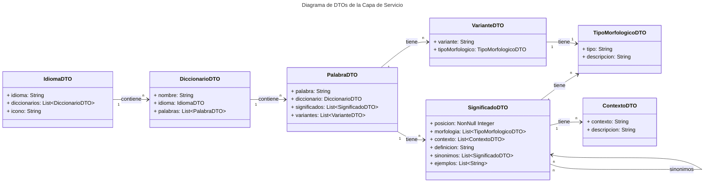
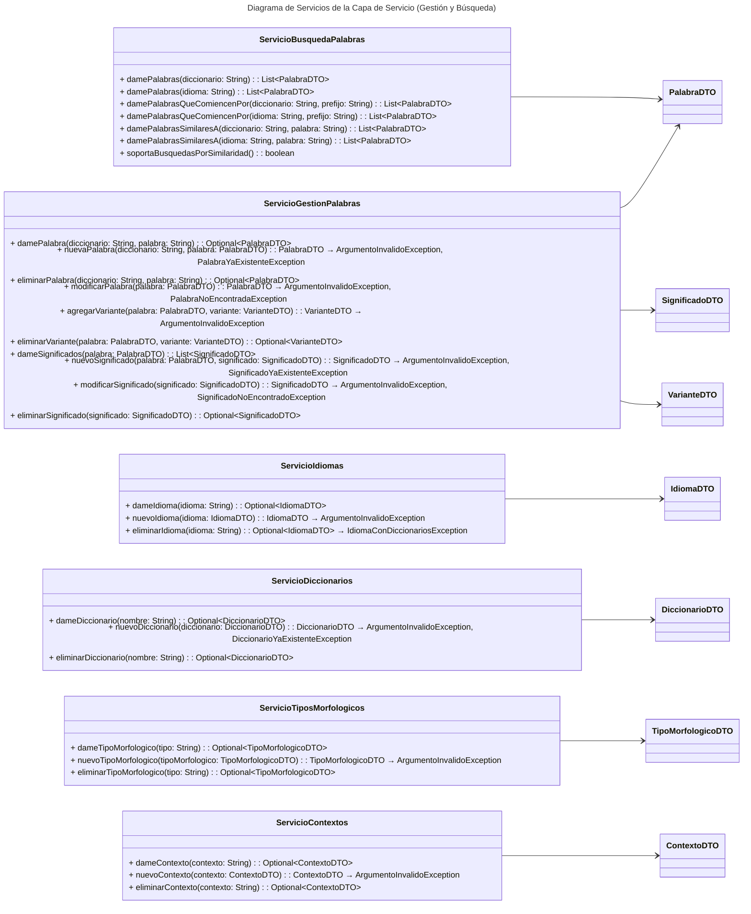
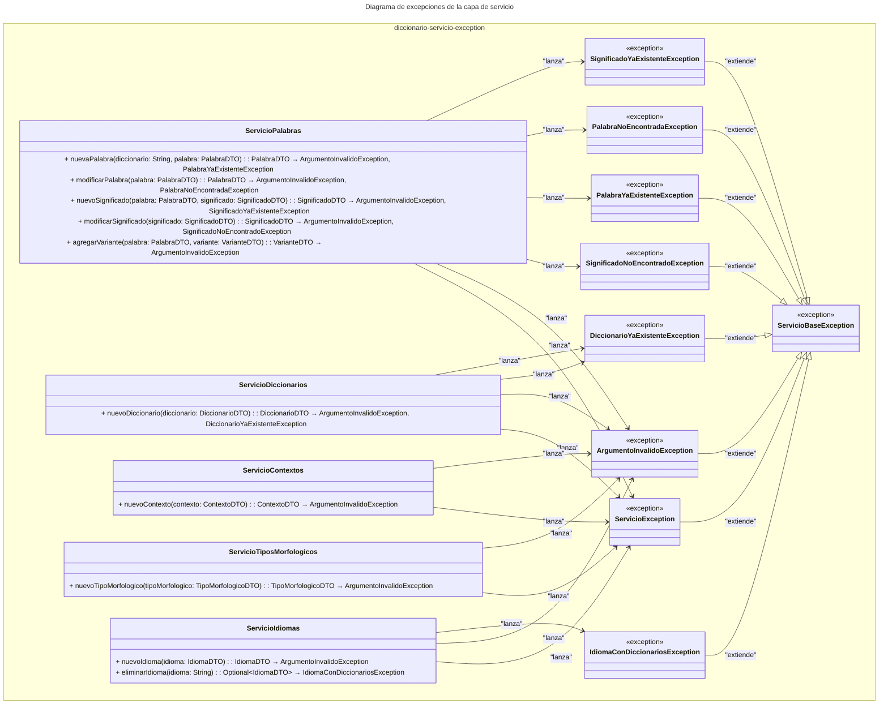

# Capa de Servicio de la Aplicación de Diccionarios

Aquí está el índice de lo que tienes actualmente en el documento de la **Capa de Servicio**:

## Índice

1. [Introducción](#1-introducción)  
   1.1 [Conceptos Clave](#11-conceptos-clave)

2. [Definición de los DTOs](#2-definición-de-los-dtos)  
   2.1 [Diagrama UML de los DTOs](#21-diagrama-uml-de-los-dtos)  
   2.2 [Detalle de los DTOs](#22-detalle-de-los-dtos)  
       2.2.1 [IdiomaDTO](#221-idiomadto)  
       2.2.2 [DiccionarioDTO](#222-diccionariodto)  
       2.2.3 [PalabraDTO](#223-palabradto)  
       2.2.4 [SignificadoDTO](#224-significadodto)  
       2.2.5 [VarianteDTO](#225-variantedto)  
       2.2.6 [TipoMorfologicoDTO](#226-tipomorfologicodto)  
       2.2.7 [ContextoDTO](#227-contextodto)

3. [Definición de los Servicios](#3-definición-de-los-servicios)  
   3.1 [Diagrama UML de los Servicios](#31-diagrama-uml-de-los-servicios)  
   3.2 [Detalle de los Servicios](#32-detalle-de-los-servicios)  
       3.2.1 [ServicioIdiomas](#321-servicioidiomas)  
       3.2.2 [ServicioDiccionarios](#322-serviciodiccionarios)  
       3.2.3 [ServicioPalabras](#323-serviciopalabras)  
       3.2.4 [ServicioSignificados](#324-serviciosignificados)  
       3.2.5 [ServicioVariantes](#325-serviciovariantes)  
       3.2.6 [ServicioTiposMorfologicos](#326-serviciotiposmorfologicos)  
       3.2.7 [ServicioContextos](#327-serviciocontextos)

4. [Excepciones de la Capa de Servicio](#4-excepciones-de-la-capa-de-servicio)  
   4.1 [Diagrama de Excepciones](#41-diagrama-de-excepciones)  
   4.2 [Detalle de las Excepciones](#42-detalle-de-las-excepciones)  
       4.2.1 [ServicioBaseException](#421-serviciobaseexception)  
       4.2.2 [ArgumentoInvalidoException](#422-argumentoinvalidoexception)  
       4.2.3 [SignificadoNoEncontradoException](#423-significadonoencontradoexception)  
       4.2.4 [DiccionarioYaExistenteException](#424-diccionarioyaexistenteexception)  
       4.2.5 [PalabraYaExistenteException](#425-palabrayaexistenteexception)  
       4.2.6 [PalabraNoEncontradaException](#426-palabranoencontradaexception)  
       4.2.7 [SignificadoYaExistenteException](#427-significadoyaexistenteexception)  
       4.2.8 [IdiomaConDiccionariosException](#428-idiomacondiccionariosexception)

---
## 1. Introducción

La **Capa de Servicio** es una parte esencial de la arquitectura de la aplicación de diccionarios. A diferencia de la **Capa de Dominio**, que se centra en la representación de los conceptos fundamentales del negocio y las reglas básicas que los rigen, la **Capa de Servicio** se encarga de implementar la lógica de negocio más compleja y orquestar las interacciones entre los distintos componentes del sistema. Esta capa actúa como intermediaria entre la **Capa de Dominio** y las capas externas, como la interfaz de usuario o los servicios de infraestructura (como bases de datos o sistemas externos), proporcionando un conjunto de operaciones que encapsulan reglas de negocio y aseguran que las transacciones dentro del sistema se realicen correctamente.

La principal responsabilidad de la **Capa de Servicio** es coordinar la lógica de negocio, aplicando las reglas necesarias para que el sistema funcione de manera correcta. Esto incluye validaciones complejas, llamadas a múltiples repositorios para recuperar o modificar datos, así como la coordinación de transacciones o tareas distribuidas.

En el contexto de una aplicación de diccionarios, la **Capa de Servicio** podría encargarse de operaciones como la validación de una nueva palabra antes de añadirla a un diccionario, la gestión de la coherencia entre los diferentes significados de una palabra, o la generación automática de variantes y sinónimos en base a reglas predefinidas. Además, podría interactuar con servicios externos para verificar si una palabra existe en otros diccionarios o para obtener datos adicionales, como traducciones o ejemplos de uso.

A lo largo de este documento, detallaremos cómo está estructurada la **Capa de Servicio** de la aplicación de diccionarios, incluyendo las principales operaciones que realiza, las dependencias que gestiona y las validaciones que aplica. Además, se presentarán diagramas que mostrarán cómo se relaciona la **Capa de Servicio** con las demás capas del sistema, como la **Capa de Dominio** y los repositorios.

### 1.1 Conceptos Clave

- **Capa de Servicio**: Encargada de la lógica de negocio y de coordinar las operaciones de la aplicación. Actúa como un intermediario entre la capa de dominio y las capas externas, gestionando las reglas de negocio complejas.
- **Operaciones**: Son las acciones que ejecuta la **Capa de Servicio** para implementar la lógica de negocio. Estas operaciones pueden involucrar una o varias entidades de la **Capa de Dominio** y suelen implicar interacciones con múltiples repositorios.
- **Validaciones**: Reglas de negocio que deben cumplirse antes de que se realicen ciertas operaciones. La **Capa de Servicio** se encarga de aplicar estas validaciones para asegurar la coherencia y consistencia de los datos.
- **Transacciones**: Operaciones que deben ejecutarse de manera atómica, es decir, todas las acciones que componen una transacción deben completarse exitosamente, o ninguna debe aplicarse.

## 2. Definición de los DTOs

Los **DTOs** (Data Transfer Objects) se utilizan para definir los objetos que facilitan el intercambio de datos entre las diferentes capas de la aplicación. En este contexto, los **DTOs** son versiones simplificadas de las entidades de la **Capa de Dominio** y no contienen lógica de negocio ni persistencia, su única responsabilidad es transportar los datos entre la **Capa de Servicio** y otras capas, como la de presentación o la de persistencia.

En el caso de la aplicación de Diccionarios, los **DTOs** representan conceptos clave como **Palabra**, **Significado**, **Diccionario**, y **Idioma**. Estos objetos encapsulan los atributos necesarios para realizar las operaciones definidas en la **Capa de Servicio** sin exponer detalles innecesarios sobre la implementación interna de las entidades del dominio. 

A continuación, se presenta el **Diagrama UML** de los DTOs que se utilizan en la **Capa de Servicio**, seguido por una descripción detallada de cada uno.
Gracias por la paciencia y aclaración. Vamos a hacer esto de forma ordenada y completa, respetando las interfaces que definimos en la **Capa de Dominio**.

### 2.1 Diagrama UML de los DTOs

### 2.2 Detalle de los DTOs

#### 2.2.1 **IdiomaDTO**
- **IdiomaDTO** representa el idioma en el que está escrito un diccionario o una palabra.
- Atributos principales:
  - `idioma`: Código que identifica el idioma (por ejemplo, `es` para español).
  - `diccionarios`: Lista de diccionarios asociados al idioma.
  - `icono`: Icono gráfico asociado al idioma (puede no ser relevante en todos los contextos).

#### 2.2.2 **DiccionarioDTO**
- **DiccionarioDTO** contiene la información sobre un diccionario, incluyendo las palabras que lo componen y el idioma al que pertenece.
- Atributos principales:
  - `nombre`: Nombre del diccionario.
  - `idioma`: Instancia de **IdiomaDTO** que indica el idioma del diccionario.
  - `palabras`: Lista de palabras incluidas en el diccionario (representadas por **PalabraDTO**).

#### 2.2.3 **PalabraDTO**
- **PalabraDTO** representa una palabra en el diccionario y su relación con los significados y variantes.
- Atributos principales:
  - `palabra`: Texto de la palabra.
  - `diccionario`: Diccionario al que pertenece la palabra, representado por **DiccionarioDTO**.
  - `significados`: Lista de significados asociados a la palabra, representados por **SignificadoDTO**.
  - `variantes`: Lista de variantes morfológicas de la palabra, representadas por **VarianteDTO**.

#### 2.2.4 **SignificadoDTO**
- **SignificadoDTO** representa el significado de una palabra en un contexto específico y puede estar asociado a varias variantes o contextos.
- Atributos principales:
  - `posicion`: Posición del significado dentro de la lista de significados de una palabra.
  - `morfologia`: Lista de morfologías asociadas al significado, representadas por **TipoMorfologicoDTO**.
  - `contexto`: Lista de contextos en los que se utiliza el significado, representados por **ContextoDTO**.
  - `definicion`: Definición textual del significado.
  - `sinonimos`: Lista de significados que son sinónimos del significado actual.
  - `ejemplos`: Lista de ejemplos que ilustran el uso del significado.

#### 2.2.5 **VarianteDTO**
- **VarianteDTO** representa una forma morfológica de una palabra.
- Atributos principales:
  - `variante`: La variante textual de la palabra.
  - `tipoMorfologico`: El tipo morfológico de la variante, representado por **TipoMorfologicoDTO**.

#### 2.2.6 **TipoMorfologicoDTO**
- **TipoMorfologicoDTO** representa la categoría gramatical de una palabra o variante (por ejemplo, sustantivo, verbo).
- Atributos principales:
  - `tipo`: Tipo de morfología.
  - `descripcion`: Descripción del tipo morfológico.

#### 2.2.7 **ContextoDTO**
- **ContextoDTO** define el contexto en el que se aplica un significado particular de una palabra.
- Atributos principales:
  - `contexto`: Texto que describe el contexto.
  - `descripcion`: Descripción del contexto.

## 3. Definición de los Servicios

Los **Servicios** son el componente clave dentro de la **Capa de Servicio**. Estos servicios contienen la lógica de negocio y gestionan las operaciones entre los repositorios y otras capas del sistema. Un servicio orquesta las operaciones necesarias para cumplir con los requisitos de negocio, como realizar validaciones, aplicar reglas de negocio, o coordinar transacciones entre entidades.

A continuación, se presenta el **Diagrama UML** que describe los servicios de la **Capa de Servicio**, seguido por una descripción detallada de cada uno de ellos.

### 3.1 Diagrama UML de los Servicios 

### 3.2 Detalle de los Servicios 

#### 3.2.1 **ServicioIdiomas**
- **ServicioIdiomas** gestiona las operaciones relacionadas con los idiomas.
- Métodos principales:
  - `dameIdioma(idioma: String)`: Busca y devuelve un idioma si existe.
  - `nuevoIdioma(idioma: IdiomaDTO)`: Crea un nuevo idioma, lanzando una `ArgumentoInvalidoException` si los datos del idioma no son válidos.
  - `eliminarIdioma(idioma: String)`: Elimina un idioma, lanzando una `IdiomaConDiccionariosException` si el idioma tiene diccionarios asociados.

#### 3.2.2 **ServicioDiccionarios**
- **ServicioDiccionarios** gestiona diccionarios en el sistema.
- Métodos principales:
  - `dameDiccionario(nombre: String)`: Busca y devuelve un diccionario específico.
  - `nuevoDiccionario(diccionario: DiccionarioDTO)`: Crea un nuevo diccionario, lanzando `ArgumentoInvalidoException` si los datos no son válidos o `DiccionarioYaExistenteException` si el diccionario ya existe.
  - `eliminarDiccionario(nombre: String)`: Elimina un diccionario del sistema.

#### 3.2.3 **ServicioPalabras**
- **ServicioPalabras** gestiona las palabras en los diccionarios.
- Métodos principales:
  - `damePalabra(diccionario: String, palabra: String)`: Busca y devuelve una palabra de un diccionario.
  - `nuevaPalabra(diccionario: String, palabra: PalabraDTO)`: Crea una nueva palabra, lanzando `ArgumentoInvalidoException` si los datos no son válidos o `PalabraYaExistenteException` si la palabra ya existe.
  - `eliminarPalabra(diccionario: String, palabra: String)`: Elimina una palabra del diccionario.
  - `modificarPalabra(palabra: PalabraDTO)`: Modifica una palabra existente, lanzando `ArgumentoInvalidoException` si los datos son inválidos o `PalabraNoEncontradaException` si la palabra no existe.

#### 3.2.4 **ServicioSignificados**
- **ServicioSignificados** gestiona los significados de las palabras.
- Métodos principales:
  - `dameSignificados(palabra: PalabraDTO)`: Devuelve una lista de significados de una palabra.
  - `nuevoSignificado(palabra: PalabraDTO, significado: SignificadoDTO)`: Crea un nuevo significado, lanzando `ArgumentoInvalidoException` si los datos no son válidos o `SignificadoYaExistenteException` si ya existe.
  - `modificarSignificado(significado: SignificadoDTO)`: Modifica un significado existente, lanzando `ArgumentoInvalidoException` si los datos no son válidos o `SignificadoNoEncontradoException` si no existe.
  - `eliminarSignificado(significado: SignificadoDTO)`: Elimina un significado de una palabra.

#### 3.2.5 **ServicioVariantes**
- **ServicioVariantes** gestiona las variantes de una palabra.
- Métodos principales:
  - `agregarVariante(palabra: PalabraDTO, variante: VarianteDTO)`: Agrega una variante, lanzando `ArgumentoInvalidoException` si los datos no son válidos.
  - `eliminarVariante(palabra: PalabraDTO, variante: VarianteDTO)`: Elimina una variante de una palabra.

#### 3.2.6 **ServicioTiposMorfologicos**
- **ServicioTiposMorfologicos** gestiona los tipos morfológicos.
- Métodos principales:
  - `dameTipoMorfologico(tipo: String)`: Busca y devuelve un tipo morfológico específico.
  - `nuevoTipoMorfologico(tipoMorfologico: TipoMorfologicoDTO)`: Crea un nuevo tipo morfológico, lanzando `ArgumentoInvalidoException` si los datos no son válidos.
  - `eliminarTipoMorfologico(tipo: String)`: Elimina un tipo morfológico.

#### 3.2.7 **ServicioContextos**
- **ServicioContextos** gestiona los contextos de los significados.
- Métodos principales:
  - `dameContexto(contexto: String)`: Busca y devuelve un contexto.
  - `nuevoContexto(contexto: ContextoDTO)`: Crea un nuevo contexto, lanzando `ArgumentoInvalidoException` si los datos no son válidos.
  - `eliminarContexto(contexto: String)`: Elimina un contexto si no está en uso.

## 4. Excepciones de la Capa de Servicio

Las excepciones son fundamentales para manejar errores y situaciones imprevistas que pueden ocurrir durante la ejecución de la lógica de negocio. En la **Capa de Servicio**, estas excepciones reflejan problemas relacionados con la validación de los datos o el estado del sistema, como la existencia de duplicados, datos no válidos o la inexistencia de ciertos recursos. La correcta gestión de excepciones permite que los servicios identifiquen y manejen errores sin que estos afecten al sistema de manera inesperada.

A continuación, se presenta un diagrama que muestra las excepciones que pueden ser lanzadas por los métodos de los servicios, así como su jerarquía.

### 4.1 Diagrama de Excepciones

### 4.2 Detalle de las Excepciones

#### 4.2.1 **ServicioBaseException**
- Excepción base de la cual heredan todas las excepciones lanzadas por los servicios. Utilizada para manejar errores generales en la lógica de negocio.

#### 4.2.2 **ArgumentoInvalidoException**
- Se lanza cuando un argumento proporcionado a un servicio no cumple con las validaciones necesarias.

#### 4.2.3 **SignificadoNoEncontradoException**
- Se lanza cuando no se encuentra un significado específico que se quiere modificar o eliminar.

#### 4.2.4 **DiccionarioYaExistenteException**
- Se lanza cuando se intenta crear un diccionario con un nombre que ya existe en el sistema.

#### 4.2.5 **PalabraYaExistenteException**
- Se lanza cuando se intenta agregar una palabra que ya existe en el diccionario especificado.

#### 4.2.6 **PalabraNoEncontradaException**
- Se lanza cuando no se encuentra una palabra específica que se quiere modificar o eliminar.

#### 4.2.7 **SignificadoYaExistenteException**
- Se lanza cuando se intenta agregar un significado que ya existe para una palabra específica.

#### 4.2.8 **IdiomaConDiccionariosException**
- Se lanza cuando se intenta eliminar un idioma que aún tiene diccionarios asociados, evitando la eliminación de datos relacionados sin advertencia.
