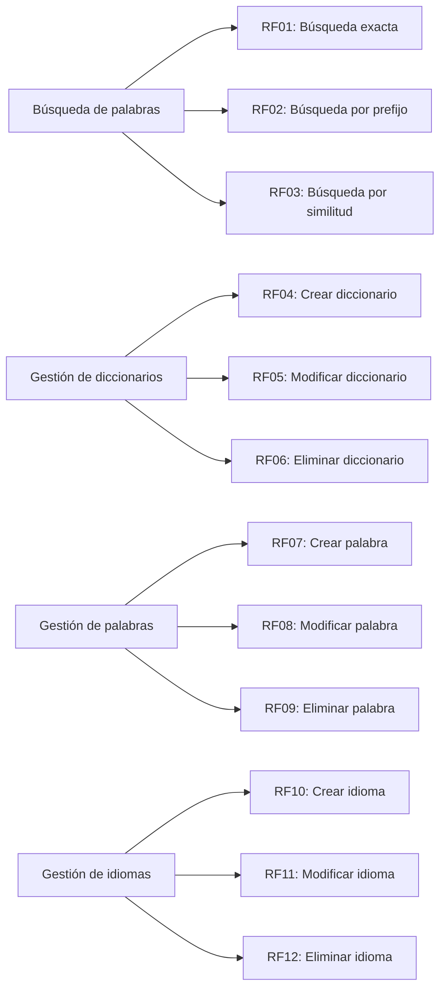

# Requisitos - Aplicación de Diccionarios

Estos son los requisitos de la aplicación de diccionarios, utilizada en los videos y formaciones de **Iván Osuna Ayuste**, y está protegido bajo la licencia **Creative Commons BY-NC-SA** y las leyes de **Copyright ©**. [Ver más...](#copyright-y-licencia)

© 2024 Iván Osuna Ayuste. Todos los derechos reservados.

## 1. Introducción

### 1.1 Propósito
Este documento describe los requisitos funcionales y no funcionales de la aplicación de diccionarios. Está diseñado para proporcionar una guía clara sobre las funcionalidades que se implementarán, así como los criterios que deben cumplirse para que el sistema cumpla con las expectativas de los usuarios finales.

### 1.2 Alcance
El proyecto es una aplicación de diccionarios que permite a los usuarios realizar búsquedas de palabras y a los editores gestionar diccionarios, palabras e idiomas. La aplicación está orientada a la formación y a la creación de contenido educativo para **Iván Osuna**.

## 2. Requisitos Funcionales

### 2.1 Requisitos Funcionales de Búsqueda de Palabras (CU01)
#### RF01: Búsqueda Exacta
El sistema debe permitir a los usuarios buscar palabras específicas dentro de un diccionario.
- **Entrada**: Texto de la palabra.
- **Salida**: Palabra encontrada con sus significados y variantes.
- **Caso de uso asociado**: CU01

#### RF02: Búsqueda por Prefijo
El sistema debe permitir a los usuarios buscar palabras que comiencen con un conjunto específico de letras.
- **Entrada**: Prefijo de la palabra.
- **Salida**: Lista de palabras que comienzan con ese prefijo.
- **Caso de uso asociado**: CU01

#### RF03: Búsqueda por Similitud
El sistema debe permitir a los usuarios buscar palabras similares basadas en un algoritmo específico (por ejemplo, Levenshtein).
- **Entrada**: Texto de la palabra.
- **Salida**: Lista de palabras similares.
- **Caso de uso asociado**: CU01

### 2.2 Requisitos Funcionales de Gestión de Diccionarios (CU02)
#### RF04: Crear Diccionario
El sistema debe permitir al editor crear nuevos diccionarios.
- **Entrada**: Nombre del diccionario, idioma asociado.
- **Salida**: Diccionario creado.
- **Caso de uso asociado**: CU02

#### RF05: Modificar Diccionario
El sistema debe permitir al editor modificar los detalles de un diccionario existente.
- **Entrada**: Nombre del diccionario, idioma.
- **Salida**: Diccionario actualizado.
- **Caso de uso asociado**: CU02

#### RF06: Eliminar Diccionario
El sistema debe permitir al editor eliminar un diccionario si no está en uso.
- **Entrada**: Nombre del diccionario.
- **Salida**: Diccionario eliminado.
- **Caso de uso asociado**: CU02

### 2.3 Requisitos Funcionales de Gestión de Palabras (CU03)
#### RF07: Crear Palabra
El sistema debe permitir al editor agregar nuevas palabras a un diccionario.
- **Entrada**: Texto de la palabra, significados, variantes.
- **Salida**: Palabra agregada al diccionario.
- **Caso de uso asociado**: CU03

#### RF08: Modificar Palabra
El sistema debe permitir al editor modificar una palabra existente en un diccionario.
- **Entrada**: Texto de la palabra, significados actualizados, variantes.
- **Salida**: Palabra modificada.
- **Caso de uso asociado**: CU03

#### RF09: Eliminar Palabra
El sistema debe permitir al editor eliminar una palabra de un diccionario.
- **Entrada**: Texto de la palabra.
- **Salida**: Palabra eliminada.
- **Caso de uso asociado**: CU03

### 2.4 Requisitos Funcionales de Gestión de Idiomas (CU04)
#### RF10: Crear Idioma
El sistema debe permitir al editor agregar nuevos idiomas.
- **Entrada**: Nombre del idioma, código de idioma.
- **Salida**: Idioma agregado al sistema.
- **Caso de uso asociado**: CU04

#### RF11: Modificar Idioma
El sistema debe permitir al editor modificar los detalles de un idioma existente.
- **Entrada**: Nombre del idioma, código de idioma.
- **Salida**: Idioma modificado.
- **Caso de uso asociado**: CU04

#### RF12: Eliminar Idioma
El sistema debe permitir al editor eliminar un idioma siempre y cuando no tenga diccionarios asociados.
- **Entrada**: Nombre del idioma.
- **Salida**: Idioma eliminado.
- **Caso de uso asociado**: CU04

---

## 3. Requisitos No Funcionales

### RNF01: Seguridad
El acceso al sistema debe estar restringido por roles (usuario y editor) y debe garantizarse la autenticación mediante un sistema de seguridad basado en tokens (JWT).
  
### RNF02: Escalabilidad
El sistema debe ser escalable horizontalmente, permitiendo agregar más servidores en caso de aumento de carga.

## 4. Suposiciones y Dependencias

- Se asume que el sistema usará una base de datos relacional para almacenar los diccionarios, palabras e idiomas. No obstante, se debe diseñar de manera que sea independiente del tipo de base de datos. El día de mañana, si se decide cambiar a una base de datos NoSQL, el sistema debería poder adaptarse sin problemas.

## 5. Relación entre Casos de Uso y Requisitos

| Código del Caso de Uso | Descripción del Caso de Uso                      | Requisitos Relacionados            |
|------------------------|-------------------------------------------------|------------------------------------|
| CU01                   | Búsqueda de palabras                            | RF01, RF02, RF03                  |
| CU02                   | Gestión de diccionarios                         | RF04, RF05, RF06                  |
| CU03                   | Gestión de palabras                             | RF07, RF08, RF09                  |
| CU04                   | Gestión de idiomas                              | RF10, RF11, RF12                  |

### 5.1 Diagrama de Trazabilidad de Requisitos

---
## Copyright y Licencia

**© 2024 Iván Osuna Ayuste. Todos los derechos reservados**.

Este material, este documento y su contenido están licenciados bajo la licencia [Licencia Creative Commons Reconocimiento-NoComercial-CompartirIgual 4.0 Internacional (CC BY-NC-SA 4.0)](https://creativecommons.org/licenses/by-nc-sa/4.0/).

 **Queda expresamente prohibido el uso en formaciones comerciales** por terceros sin autorización expresa del autor.

 ---
 

    <a href="https://github.com/IvanciniGT/appDiccionarios/blob/master/casos-uso.md">Casos de uso</a> |
    <a href="https://github.com/IvanciniGT/appDiccionarios/blob/master/capa-controlador.md">Capa de Controlador</a> |
    <a href="https://github.com/IvanciniGT/appDiccionarios/blob/master/capa-servicio.md">Capa de Negocio</a> |
    <a href="https://github.com/IvanciniGT/appDiccionarios/blob/master/capa-dominio.md">Capa de Dominio</a>

